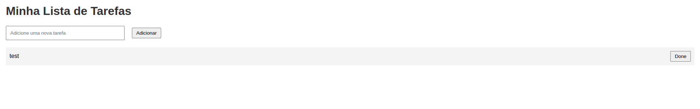

# Projeto de Integração: FastAPI, Jinja2 e JSX

Este projeto é um experimento para demonstrar como integrar **FastAPI**, **Jinja2** e **JSX** em uma aplicação web simples. A aplicação resultante é uma lista de tarefas (to-do list) interativa, onde os usuários podem adicionar e remover tarefas.

**Nota:** Este é um projeto experimental de teste, destinado a fins educacionais e de demonstração.



## Índice

- [Introdução](#introdução)
- [Visão Geral do Projeto](#visão-geral-do-projeto)
- [Tecnologias Utilizadas](#tecnologias-utilizadas)
- [Estrutura do Projeto](#estrutura-do-projeto)
- [Instalação](#instalação)
- [Executando a Aplicação](#executando-a-aplicação)
- [Uso](#uso)
- [Explicação do Código](#explicação-do-código)
  - [Backend (`main.py`)](#backend-mainpy)
  - [Frontend (`app.js`)](#frontend-appjs)
  - [Template Jinja2 (`index.html`)](#template-jinja2-indexhtml)
  - [Estilos CSS (`styles.css`)](#estilos-css-stylescss)
- [Considerações Finais](#considerações-finais)

## Introdução

Este projeto tem como objetivo mostrar a potencialidade da integração entre o **FastAPI** (um framework web rápido e moderno para construir APIs com Python), **Jinja2** (um motor de templates para renderizar HTML no lado do servidor) e **JSX** (uma extensão de sintaxe para JavaScript que facilita a escrita de componentes React).

## Visão Geral do Projeto

A aplicação é uma lista de tarefas simples que permite:

- **Adicionar Tarefas**: Os usuários podem adicionar novas tarefas à lista.
- **Remover Tarefas**: Cada tarefa possui um botão "Done" que, ao ser clicado, remove a tarefa da lista.
- **Interatividade em Tempo Real**: A interface é atualizada em tempo real usando React com JSX.

## Tecnologias Utilizadas

- **Python 3.6+**
- **FastAPI**
- **Jinja2**
- **React (com JSX)**
- **Babel (para transpilar JSX no navegador)**
- **HTML/CSS**
- **JavaScript**

## Estrutura do Projeto

```
- main.py
- templates/
    - index.html
- static/
    - app.js
    - styles.css
```

## Instalação

1. **Clone o repositório ou copie os arquivos para o seu ambiente local.**

2. **Crie um ambiente virtual e instale as dependências:**

   ```bash
   # Criar o ambiente virtual
   python -m venv venv

   # Ativar o ambiente virtual
   # No Linux/macOS:
   source venv/bin/activate
   # No Windows:
   venv\Scripts\activate

   # Instalar as dependências
   pip install fastapi uvicorn jinja2 aiofiles python-multipart
   ```

## Executando a Aplicação

1. **Inicie o servidor FastAPI:**

   ```bash
   uvicorn main:app --reload
   ```

2. **Acesse a aplicação no seu navegador:**

   Abra `http://127.0.0.1:8000/` no seu navegador preferido.

## Uso

- **Adicionar uma Tarefa:**
  - Digite a descrição da tarefa no campo de entrada.
  - Clique no botão "Adicionar" ou pressione "Enter".
- **Remover uma Tarefa:**
  - Clique no botão "Done" ao lado da tarefa que deseja remover.

## Explicação do Código

### Backend (`main.py`)

```python
from fastapi import FastAPI, Request
from fastapi.templating import Jinja2Templates
from fastapi.responses import HTMLResponse
from fastapi.staticfiles import StaticFiles
from pydantic import BaseModel
import uuid

app = FastAPI()
templates = Jinja2Templates(directory="templates")

# Montar a pasta static para servir arquivos estáticos
app.mount("/static", StaticFiles(directory="static"), name="static")

# Modelo de Tarefa
class Task(BaseModel):
    id: str
    text: str

# Lista de tarefas em memória
tasks = []

@app.get("/", response_class=HTMLResponse)
async def read_index(request: Request):
    return templates.TemplateResponse("index.html", {"request": request})

@app.get("/api/tasks")
async def get_tasks():
    return tasks

@app.post("/api/tasks")
async def add_task(task: Task):
    tasks.append(task)
    return {"message": "Tarefa adicionada com sucesso!"}

@app.delete("/api/tasks/{task_id}")
async def delete_task(task_id: str):
    global tasks
    tasks = [task for task in tasks if task.id != task_id]
    return {"message": "Tarefa removida com sucesso!"}
```

**Descrição:**

- **Servindo Arquivos Estáticos:** Usamos `StaticFiles` para servir CSS e JavaScript da pasta `static`.
- **Modelo `Task`:** Define o modelo de dados para uma tarefa, incluindo `id` e `text`.
- **Endpoints:**
  - `GET /`: Renderiza a página inicial usando um template Jinja2.
  - `GET /api/tasks`: Retorna a lista de tarefas em formato JSON.
  - `POST /api/tasks`: Adiciona uma nova tarefa à lista.
  - `DELETE /api/tasks/{task_id}`: Remove uma tarefa pelo `id`.

### Frontend (`app.js`)

```jsx
function App() {
    const [tasks, setTasks] = React.useState([]);
    const [taskText, setTaskText] = React.useState("");

    React.useEffect(() => {
        fetch("/api/tasks")
            .then(response => response.json())
            .then(data => setTasks(data));
    }, []);

    const addTask = (e) => {
        e.preventDefault();
        if (taskText.trim() === "") return;

        const newTask = { id: uuidv4(), text: taskText };

        fetch("/api/tasks", {
            method: "POST",
            headers: {
                "Content-Type": "application/json"
            },
            body: JSON.stringify(newTask)
        })
        .then(response => response.json())
        .then(() => {
            setTasks([...tasks, newTask]);
            setTaskText("");
        });
    };

    const deleteTask = (id) => {
        fetch(`/api/tasks/${id}`, {
            method: "DELETE",
        })
        .then(response => response.json())
        .then(() => {
            setTasks(tasks.filter(task => task.id !== id));
        });
    };

    return (
        <div>
            <form onSubmit={addTask}>
                <input
                    type="text"
                    value={taskText}
                    onChange={(e) => setTaskText(e.target.value)}
                    placeholder="Adicione uma nova tarefa"
                />
                <button type="submit">Adicionar</button>
            </form>
            <ul>
                {tasks.map((task) => (
                    <li key={task.id}>
                        {task.text}
                        <button onClick={() => deleteTask(task.id)}>Done</button>
                    </li>
                ))}
            </ul>
        </div>
    );
}

// Função para gerar IDs únicos no frontend
function uuidv4() {
    return 'xxxxxxxx-xxxx-4xxx-yxxx-xxxxxxxxxxxx'.replace(/[xy]/g, function(c) {
        const r = Math.random() * 16 | 0, v = c === 'x' ? r : (r & 0x3 | 0x8);
        return v.toString(16);
    });
}

ReactDOM.render(<App />, document.getElementById('root'));
```

**Descrição:**

- **Estado e Efeitos:**
  - `tasks`: Armazena a lista de tarefas.
  - `taskText`: Armazena o texto da nova tarefa.
  - `useEffect`: Busca as tarefas existentes ao montar o componente.
- **Funções:**
  - `addTask`: Adiciona uma nova tarefa enviando uma requisição `POST` ao backend.
  - `deleteTask`: Remove uma tarefa enviando uma requisição `DELETE` ao backend.
- **Renderização:**
  - Formulário para adicionar novas tarefas.
  - Lista de tarefas com botão "Done" para cada tarefa.

### Template Jinja2 (`index.html`)

```html
<!DOCTYPE html>
<html lang="pt">
<head>
    <meta charset="UTF-8">
    <title>Lista de Tarefas</title>
    <link rel="stylesheet" href="/static/styles.css">
</head>
<body>
    <h1>Minha Lista de Tarefas</h1>
    <div id="root"></div>

    <!-- Importar React e ReactDOM -->
    <script src="https://unpkg.com/react@17/umd/react.development.js" crossorigin></script>
    <script src="https://unpkg.com/react-dom@17/umd/react-dom.development.js" crossorigin></script>

    <!-- Babel para transpilar JSX no navegador -->
    <script src="https://unpkg.com/@babel/standalone/babel.min.js"></script>

    <!-- Seu código JSX -->
    <script type="text/babel" src="/static/app.js"></script>
</body>
</html>
```

**Descrição:**

- **Estrutura Básica:** Contém o elemento `<div id="root"></div>` onde o React renderiza a aplicação.
- **Importações:**
  - React e ReactDOM para criar a interface do usuário.
  - Babel para transpilar JSX em JavaScript no navegador.
- **Scripts:**
  - Carrega o código JSX de `app.js`.

### Estilos CSS (`styles.css`)

```css
body {
    font-family: Arial, sans-serif;
    margin: 20px;
}

h1 {
    color: #333;
}

form {
    margin-bottom: 20px;
}

input[type="text"] {
    padding: 10px;
    width: 300px;
    margin-right: 10px;
}

button {
    padding: 10px 15px;
}

ul {
    list-style-type: none;
    padding: 0;
}

li {
    display: flex;
    justify-content: space-between;
    align-items: center;
    background: #f4f4f4;
    margin-bottom: 5px;
    padding: 10px;
}

button:hover {
    background-color: #ddd;
    cursor: pointer;
}
```

**Descrição:**

- **Estilização Geral:** Define fontes, cores e margens para uma aparência limpa.
- **Formulário e Entradas:** Estiliza o formulário de adição de tarefas.
- **Lista de Tarefas:** Estiliza a lista e os itens para melhor visualização.
- **Botão "Done":** Adiciona estilos para o botão de remoção de tarefas.

## Considerações Finais

Este projeto demonstra como combinar **FastAPI**, **Jinja2** e **JSX** para criar uma aplicação web interativa e moderna. Embora seja um experimento de teste, ele fornece uma base sólida para entender como essas tecnologias podem trabalhar juntas.

**Pontos Importantes:**

- **Integração de Tecnologias:** O FastAPI serve a aplicação e fornece endpoints de API, o Jinja2 renderiza o template inicial, e o React (com JSX) gerencia a interface do usuário.
- **Comunicação Frontend-Backend:** A aplicação React se comunica com o backend usando `fetch` para realizar operações CRUD.
- **Estado e Atualização Dinâmica:** O uso de React permite que a interface reflita mudanças de estado em tempo real.

**Possíveis Extensões:**

- **Persistência de Dados:** Integrar um banco de dados para armazenar tarefas de forma persistente.
- **Autenticação e Autorização:** Adicionar login de usuário para listas de tarefas personalizadas.
- **Melhorias na Interface:** Implementar feedback visual, validação de entradas e estilos aprimorados.
- **Processo de Build do Frontend:** Utilizar ferramentas como Webpack ou Parcel para transpilar e empacotar o código JSX para produção.

**Nota Final:** Este projeto é um experimento para fins educacionais. Em aplicações de produção, recomenda-se seguir as melhores práticas de segurança, desempenho e manutenção de código.

---

Espero que este projeto sirva como um ponto de partida útil para entender e explorar a integração entre FastAPI, Jinja2 e JSX em aplicações web.